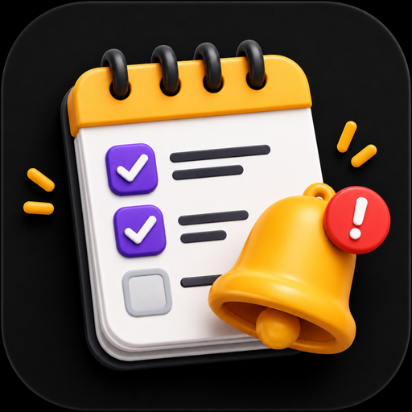

# Meus Lembretes

  

App de lembretes/checklist feito em HTML, CSS e JavaScript puros. Funciona como **PWA** — pode ser instalado no celular ou computador como um app normal.

## Como instalar como app

1. Ative o GitHub Pages neste repositório (Settings → Pages → Branch: main → Save)
2. Acesse o link gerado pelo GitHub Pages pelo navegador do celular
3. No Chrome/Android: toque no menu (⋮) → **"Instalar app"** (ou "Adicionar à tela inicial")
4. No Safari/iOS: toque em Compartilhar → **"Adicionar à Tela de Início"**

> ⚠️ A opção de instalar só aparece quando o site está publicado via HTTPS (como o GitHub Pages oferece) — não funciona abrindo o `index.html` direto do computador.

## Estrutura

- `index.html` — aplicação completa (HTML + CSS + JS)
- `manifest.json` — configuração do PWA (nome, ícones, cores)
- `sw.js` — service worker (permite funcionar offline)
- `icon-192.png` / `icon-512.png` — ícones do app
- `capa.png` — imagem de capa do projeto
